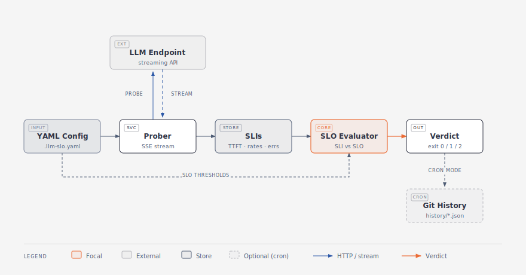

# llm-slo-checker

> SLOs as code for LLM endpoints. Probe, measure, verdict.

[](https://opensource.org/licenses/MIT)
[](https://github.com/amarrtech/llm-slo-checker/actions)

Point it at an OpenAI-compatible LLM endpoint. Configure your SLOs in YAML. Get a verdict: `PASS`, `FAIL`, or `INCONCLUSIVE`. Exits 0 / 1 / 2 for CI. Runs hourly in GitHub Actions. Commits history to git so you can see reliability over time.

Built specifically for **streaming** LLM APIs where "success" is not binary — a stream that delivered 47 tokens then disconnected is a distinct case from a 500 error, and this tool tracks them separately.

## How it works



Read the pipeline left to right: your YAML declares both the **target** (base URL, model, API key env) and the **SLO thresholds**. The **Prober** streams from the LLM endpoint and records SSE-level events. Those samples are aggregated into **SLIs** (TTFT p95/p99, success rate, completion rate, error counts) and passed to the **SLO Evaluator**, which compares each SLI against the threshold from your config and emits a **Verdict** — `PASS` / `FAIL` / `INCONCLUSIVE` with exit code `0` / `1` / `2` for CI.

Run it in cron mode and each verdict also appends a JSON snapshot to `history/`, committed by GitHub Actions — so `git log` becomes your SLI trend.

## Quickstart

Install:
```bash
pip install -e .
```

Write a config (see [examples/anthropic-sonnet.yaml](examples/anthropic-sonnet.yaml)):
```yaml
target:
  base_url: https://api.anthropic.com
  model: claude-sonnet-4-6
  api_key_env: ANTHROPIC_API_KEY

probing:
  min_samples: 30
  concurrent_probes: 3
  budget_usd_per_month: 5.00
  request_max_tokens: 30
  timeout_seconds: 30
  interval_seconds: 3600
  window_hours: 24

sample_prompts:
  file: sample-prompts.txt

slos:
  success_rate: 0.995
  completion_rate: 0.99
  ttft_p95_ms: 2000
  ttft_p99_ms: 4000
  total_p95_ms: 20000
```

Run:
```bash
export ANTHROPIC_API_KEY=sk-...
llm-slo check --config examples/anthropic-sonnet.yaml --samples 30
```

Output:
```
[ SLO CHECK: PASS ]
Samples in window: 30

SLI                       Expected     Actual          Verdict  Budget
------------------------------------------------------------------------------
success_rate              0.995        1.000           PASS     100.0% left
completion_rate           0.99         1.000           PASS     100.0% left
ttft_p95_ms               2000         842.3           PASS     -
ttft_p99_ms               4000         1230.1          PASS     -
total_p95_ms              20000        4218.0          PASS     -
```

Exits 0 on PASS, 1 on FAIL, 2 on INCONCLUSIVE.

## Three ways to use it

### 1. Local CLI

```bash
llm-slo check --config my-slos.yaml --samples 50
```

### 2. In CI (fail the build on SLO violation)

```yaml
- run: llm-slo check --config .llm-slo.yaml --samples 30
  env:
    ANTHROPIC_API_KEY: ${{ secrets.ANTHROPIC_API_KEY }}
```

### 3. Hourly cron (see [.github/workflows/live-slo-check.yml](.github/workflows/live-slo-check.yml))

Runs at the top of every hour, probes 20 requests, commits JSON to `history/`. Build week-over-week SLI trends from git log.

## What SLIs it tracks

- `success_rate` — probes that returned 200 with at least one token
- `completion_rate` — successful probes that received `message_stop` cleanly
- `ttft_p50_ms` / `ttft_p95_ms` / `ttft_p99_ms` — time to first non-empty text token
- `total_p50_ms` / `total_p95_ms` / `total_p99_ms` — full request latency
- `error_counts` — per error class (HTTP 5xx, HTTP 429, timeout, network)

See [DESIGN.md](DESIGN.md) for the reasoning behind these choices — including why success and completion are separate SLIs.

## What it does NOT do (v0.1)

- No Prometheus exporter (planned v0.2)
- No cost-per-successful-token SLI (planned v0.2)
- No streaming inter-token-latency (ITL) SLI (planned v0.2)
- No tool-use / vision input support (planned v0.3)
- No output quality SLI (planned v0.5, needs judge model)

If any of these are important to you, open an issue and I'll prioritize.

## Compatibility

- Python 3.11+
- Any endpoint that speaks the Anthropic Messages streaming format
- GitHub Actions for scheduled probing (free tier plenty)

## License

MIT. Fork it, use it, sell derivatives.
